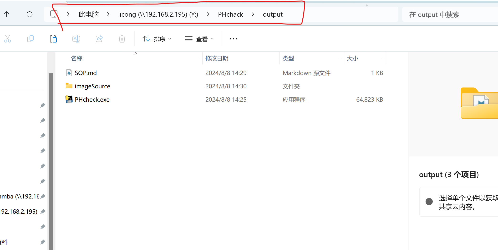
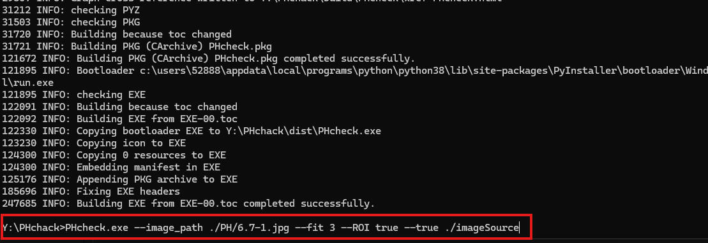

# PH值检测
## 主程序:PHcheck.exe 使用方法
   1. 在程序所在目录的地址栏输入 cmd 后 按enter 进入终端
   
   2. 进入终端后输入  PHcheck.exe 
   3. PHcheck.exe 有三个参数  

|参数名|功能说明|    
|-----|-----|   
| --image_path | 待测试图片路径 |  
| --ROI|是否需要自动检测兴趣区域，默认False，即输入图像为裁剪过目标区域的图片        
| --fit|拟合强度，默认=3，一般不需要修改，测量误差较大时可尝试调整该参数|         
| --true |ph真值路径，默认为imageSource文件夹，测试时确保imageSource文件夹与PHcheck.exe 在同一目录即可。|

## imageSource文件夹说明
### 该文件加存放的是裁剪过的真值图片。每次程序运行时都会重新标定。该文件夹内的图片名字是对应的PH真值，如需更换或添加图片，按同样格式放入图片即可

## 使用示例

### 红色框框内为完整代码。如已有裁剪后的图片可执行指令：
```
PHcheck.exe --image_path ./PH/6.7-1.jpg
```
### 输入图片未经过裁剪，则：
```
PHcheck.exe --image_path ./PH/6.7-1.jpg --ROI true
```